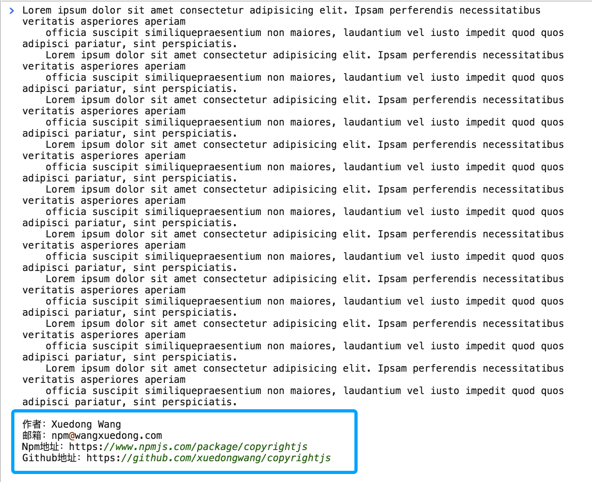

## 项目简介
`copyrightjs`是一个零依赖、强大、实用的`Javascript`工具库，它可以轻松的给你的剪切板增加版权信息。
## 展示

## 安装
```shell
$ npm install -S copyrightjs
// or
$ yarn add copyrightjs
```
## 使用
### 1. ES6 方式使用
```js
import Copyrightjs from 'copyrightjs';

const copyright = new Copyrightjs({
  template: `
    作者：Xuedong Wang
    邮箱：npm@wangxuedong.com
    Npm地址：https://www.npmjs.com/package/copyrightjs
    Github地址：https://github.com/xuedongwang/copyrightjs
  `
});
// 不想使用了
copyright.destroyed();
```
### 2. Commonjs 使用
```js
const Copyrightjs = require('copyrightjs');

const copyright = new Copyrightjs({
  template: `
    作者：Xuedong Wang
    邮箱：npm@wangxuedong.com
    Npm地址：https://www.npmjs.com/package/copyrightjs
    Github地址：https://github.com/xuedongwang/copyrightjs
  `
});
// 不想使用了
copyright.destroyed();
```
### 3. `<script>` 方式
```html
<!DOCTYPE html>
<html lang="en">
<head>
  <meta charset="UTF-8">
  <title>Copyrightjs</title>
</head>
<body>
  <script src="path/copyrightjs-0.0.1.js"></script>
  <script>
    var copyright = new Copyrightjs({
      template: `
        作者：Xuedong Wang
        邮箱：npm@wangxuedong.com
        Npm地址：https://www.npmjs.com/package/copyrightjs
        Github地址：https://github.com/xuedongwang/copyrightjs
      `
    });
    // 不想使用了
    copyright.destroyed();
  </script>
</body>
</html>
```
## 联系我
微信：V711400
Email: npm@wangxuedong.com
## 协议
MIT
